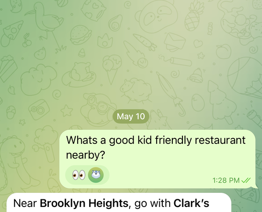

<div align="center">


<br/>
<br/>

**Lilo is a Telegram personal assistant**

[](https://discord.gg/RAKmnS2G)
[](./LICENSE)

</div>

Here are a few things Lilo can do:

- Send Lilo photos of food, and it tracks your calories.
- Leave a voice note on your run to pause your supplements, and Lilo adds a TODO.
- Ask Lilo to remind you when the Knicks game starts and send you score updates every 5 minutes.
- Ask Lilo to read an article out loud. Or give you a summary of the top stories on Hacker News.
- Collect a Uber receipt, and pull it up later to file for a reimbursement at work.
- Schedule a meeting with Jess next week, ask for suggestions on meeting location, and next week, remind you when it’s time to leave for the meeting.

Telegram is the easiest way to use Lilo, but it works wherever you do: WhatsApp, web, desktop, mobile, or email.

## What you can ask Lilo

| Find kid-friendly dinner | Track meals | Pull up return info |
| --- | --- | --- |
|  |  |  |
| Ask nearby and get a practical recommendation. | Send food and keep calories up to date. | Pull up return codes, receipts, and files. |

| Manage TODOs | Follow a game | Find a work spot |
| --- | --- | --- |
|  |  |  |
| Turn voice notes into durable TODOs. | Get summaries and live score updates. | Find laptop-friendly cafes nearby. |

[Features](#features) · [Quick start](#quick-start) · [Configuration](#configuration) · [Workspace apps](#workspace-apps) · [External messaging](#external-messaging) · [Mobile app](#mobile-app) · [Security](#security) · [Deployment](#deployment)


---

> [!WARNING]
> **Alpha software.** Expect breaking changes, rough setup, and bugs. Back
> up your workspace via git sync, and read [Security](#security) before
> running it on a public host.

## Quick start

### Prerequisites

- Node.js 20+
- [pnpm](https://pnpm.io) 10+
- An API key for at least one of: OpenAI, Anthropic, OpenRouter

### 1. Install

```bash
git clone https://github.com/abi/lilo.git
cd lilo
pnpm install
```

### 2. Configure

Create a `.env.local` at the repo root:

```bash
# Required
LILO_WORKSPACE_DIR=./workspace          # where the agent's files live
LILO_SESSIONS_DIR=./.lilo-sessions      # persistent chat session storage

# At least one chat model
OPENAI_API_KEY=sk-...                   # enables GPT 5.5
ANTHROPIC_API_KEY=sk-ant-...            # enables Claude Opus 4.7
OPENROUTER_API_KEY=sk-or-...            # enables OpenRouter-routed models

# Recommended
LILO_AUTH_PASSWORD=choose-a-strong-password   # locks down the whole app
```

See [Configuration](#configuration) for the full list.

### 3. Run

```bash
pnpm run dev   # backend (http://localhost:8787) + frontend (http://localhost:5800) + typechecks
```

Open `http://localhost:5800`. If you set `LILO_AUTH_PASSWORD`, you'll get a
login screen on first visit.

Your workspace should be auto-bootstrapped from the bundled  
`[workspace-template/](./workspace-template)`, so you'll immediately have a  
Desktop, TODO list, Calories tracker, and a handful of other apps to play with.

---

## Configuration

All env vars are read from (in order of precedence):

1. Shell-exported variables
2. `.env.local` at the repo root
3. `.env` at the repo root

### Core


| Variable                   | Required | Default              | Description                                                                                                 |
| -------------------------- | -------- | -------------------- | ----------------------------------------------------------------------------------------------------------- |
| `LILO_WORKSPACE_DIR`       | ✅        | —                    | Directory the agent works in. Auto-bootstrapped from `workspace-template/` if empty.                        |
| `LILO_SESSIONS_DIR`        | ✅        | —                    | Where persistent Pi chat sessions (`chats/`) and app sessions (`apps/`) are stored.                         |
| `LILO_AUTH_PASSWORD`       | —        | unset (open)         | Single-password login for the web app + all APIs + WebSockets. Leave unset for a fully open local instance. |
| `LILO_AUTH_SESSION_SECRET` | —        | `LILO_AUTH_PASSWORD` | HMAC secret for the session cookie. Rotate to invalidate all existing sessions.                             |
| `PORT`                     | —        | `8787`               | Backend HTTP port.                                                                                          |


### Chat models

At least one is required to actually use Lilo.


| Variable             | Enables                                                                              |
| -------------------- | ------------------------------------------------------------------------------------ |
| `OPENAI_API_KEY`     | GPT 5.5, GPT 5.4 Mini                                                                |
| `ANTHROPIC_API_KEY`  | Claude Opus 4.7                                                                      |
| `OPENROUTER_API_KEY` | OpenRouter routing for GPT 5.5, GPT 5.4 Mini, Claude Opus 4.7, and Kimi K2.6          |

If `OPENROUTER_API_KEY` is set, Lilo can route supported models through
OpenRouter. Native provider keys take priority: for example, if
`OPENAI_API_KEY` is set, GPT models use OpenAI directly; if it is missing but
`OPENROUTER_API_KEY` is set, GPT models route through OpenRouter instead.

Limit the chat dropdown/API to specific models with a comma-separated allowlist.

```bash
LILO_CHAT_MODEL_ALLOWLIST=gpt-5.5,gpt-5.4-mini
```

Supported allowlist IDs: `claude-opus-4-7`, `gpt-5.5`,
`gpt-5.4-mini`, and `moonshotai/kimi-k2.6`.

### Agent tools (optional)

Each one unlocks a corresponding agent tool. Missing keys just disable the
tool — the agent keeps working without them.


| Variable                 | Tool                                                                      |
| ------------------------ | ------------------------------------------------------------------------- |
| `REPLICATE_API_KEY`      | `generate_images`, `remove_background`                                    |
| `LILO_IMAGE_MODEL`       | Image model — `nano-banana` (default), `nano-banana-2`, `flux-2-klein-4b` |
| `FIRECRAWL_API_KEY`      | `web_search`, `web_scrape`                                                |
| `BROWSERBASE_API_KEY`    | `browser_automate`                                                        |
| `BROWSERBASE_PROJECT_ID` | Optional project id; usually inferred                                     |


### Git sync (optional)

Point `LILO_WORKSPACE_GIT_URL` at a git repo to make `LILO_WORKSPACE_DIR`
git-backed on boot. If the workspace is not already a git repo, Lilo initializes
one and sets `origin` to this URL; if it is already a repo, Lilo keeps `origin`
in sync with this value. This keeps your workspace (apps, data, and memories)
versioned and portable across hosts. The frontend shows a manual "Sync" button
that runs pull/rebase and push; it expects workspace changes to be committed
first. Hide it with `VITE_ENABLE_WORKSPACE_SYNC=false` when you aren't using this
flow.


| Variable                     | Scope    | Description                                                   |
| ---------------------------- | -------- | ------------------------------------------------------------- |
| `LILO_WORKSPACE_GIT_URL`     | backend  | Git remote to configure as `origin` for `LILO_WORKSPACE_DIR`. |
| `VITE_ENABLE_WORKSPACE_SYNC` | frontend | Show the Sync button in the UI. Defaults to `true`.           |


### Frontend observability (optional)

Set at build time — Vite only inlines `VITE_*` vars.


| Variable                                          | Description                          |
| ------------------------------------------------- | ------------------------------------ |
| `VITE_ENABLE_SENTRY` / `VITE_SENTRY_DSN`          | Opt in to Sentry for browser errors. |
| `VITE_ENABLE_LOGROCKET` / `VITE_LOGROCKET_APP_ID` | Opt in to LogRocket session replay.  |


### Backend observability (optional)


| Variable        | Default | Description                          |
| --------------- | ------- | ------------------------------------ |
| `ENABLE_SENTRY` | `false` | Opt in to Sentry for backend errors. |
| `SENTRY_DSN`    | unset   | Backend Sentry DSN.                  |


---

## Workspace apps

The most distinctive thing about Lilo: **the agent builds its own apps**. Each
app lives as a directory of HTML + assets under `$LILO_WORKSPACE_DIR/`, runs
in a sandboxed iframe, and can read/write its own files, open chats, and make
HTTP calls through a built-in `window.lilo` API. Ask the agent *"build me a
habit tracker"* and it scaffolds one — no build step.

**→ [Full guide: docs/workspace-apps.md](./docs/workspace-apps.md)** (directory
layout, the `window.lilo` API surface, and the in-viewer element picker).

---

## External messaging

Lilo can be an email/SMS/Telegram chatbot. Each channel is an opt-in plugin —
leave its env vars unset and it's disabled.

### Native app links (optional)

Messaging channels can include buttons that open workspace apps or files in the
native iOS app. For multi-workspace/self-hosted installs, use the separate
minimal broker service in [`link-broker/`](./link-broker/) as the single
Universal Link domain for the app.

Set these on each Lilo workspace backend that should generate native app links:

| Variable               | Description                                                                                                  |
| ---------------------- | ------------------------------------------------------------------------------------------------------------ |
| `LILO_PUBLIC_APP_URL`  | Public HTTPS origin for this Lilo workspace. Used to tell the native app which workspace should handle a link. |
| `LILO_LINK_BROKER_URL` | Public HTTPS origin of the link broker. When set, workspace links in Telegram replies are sent through it.     |

Set this on the link broker service, not on every workspace backend:

| Variable                          | Description                                                                                   |
| --------------------------------- | --------------------------------------------------------------------------------------------- |
| `LILO_IOS_UNIVERSAL_LINK_APP_IDS` | Comma-separated Apple app IDs in `TEAM_ID.bundle.identifier` format to advertise in the AASA. |

The iOS app entitlement should contain the broker domain, for example
`applinks:<broker-domain>`. Only set `LILO_IOS_UNIVERSAL_LINK_APP_IDS` on the
workspace backend if you intentionally want that backend to serve its own
`apple-app-site-association` file instead of using the broker.

### Email (Resend)

```bash
RESEND_API_KEY=re_...
RESEND_WEBHOOK_SECRET=whsec_...
LILO_EMAIL_AGENT_ADDRESS=hi@yourdomain.com        # your bot's inbound address
LILO_EMAIL_REPLY_FROM="Lilo <lilo@yourdomain.com>"
LILO_EMAIL_ALLOWED_SENDERS=you@yours.com,partner@theirs.com   # allowlist
LILO_PUBLIC_APP_URL=https://your-lilo.example.com # optional; adds chat permalinks and native app links
```

1. Set up a receiving domain in Resend.
2. Create a webhook pointing to `https://your-lilo/api/inbound-email` with the
  `email.received` event.
3. Send Lilo an email; it replies in-thread.

Replies set `Reply-To: LILO_EMAIL_AGENT_ADDRESS`, so the recipient's reply round-trips
back into the same inbox.

### WhatsApp (Twilio)

```bash
TWILIO_ACCOUNT_SID=AC...
TWILIO_AUTH_TOKEN=...
LILO_WHATSAPP_AGENT_NUMBER=whatsapp:+15555550123
LILO_WHATSAPP_ALLOWED_SENDERS=whatsapp:+15555550124
```

Point a Twilio WhatsApp webhook at `https://your-lilo/api/inbound-whatsapp`.

### Telegram

```bash
TELEGRAM_BOT_TOKEN=123456:ABC-...
TELEGRAM_WEBHOOK_SECRET=long-random-secret
LILO_TELEGRAM_ALLOWED_USER_IDS=123456789
```

Point your Telegram bot webhook at `https://your-lilo/api/inbound-telegram`
and pass the same secret as Telegram's `secret_token`:

```bash
curl -X POST "https://api.telegram.org/bot$TELEGRAM_BOT_TOKEN/setWebhook" \
  -d "url=https://your-lilo/api/inbound-telegram" \
  -d "secret_token=$TELEGRAM_WEBHOOK_SECRET"
```

`LILO_TELEGRAM_ALLOWED_USER_IDS` must contain numeric Telegram user IDs, not
group chat IDs. To find yours, message your bot and inspect `getUpdates`, or use
a Telegram ID helper bot such as `@userinfobot`.

> Each contact gets their own persistent chat, so the agent remembers your
> conversation across messages.

---

## Mobile app

Lilo works well as an iPhone home-screen app. It still needs your Lilo backend
to be running; this is an app-like Safari wrapper, not an offline native app.

1. Deploy Lilo somewhere your phone can reach, ideally over HTTPS. Railway's
   generated public domain works well.
2. On your iPhone, open the Lilo URL in Safari. Use Safari specifically; other
   iOS browsers do not expose the same Add to Home Screen flow.
3. Log in if you configured `LILO_AUTH_PASSWORD`.
4. Tap the Share button, then tap **Add to Home Screen**.
5. Name it `Lilo`, tap **Add**, and launch it from your home screen.

---

## Security

Lilo is built for a **single, self-hosted user** — not multi-tenant SaaS.

- **Set `LILO_AUTH_PASSWORD`** before exposing an instance to the internet.
  It gates the web app, all REST/SSE/WebSocket endpoints, and workspace
  apps. Without it, everything is open.
- **The agent has shell, filesystem, and network access.** Prompt injection
  is a real risk — anything it reads (web pages, emails, PDFs) can try to
  hijack it. Keep messaging allowlists (`LILO_EMAIL_ALLOWED_SENDERS`,
  `LILO_WHATSAPP_ALLOWED_SENDERS`, `LILO_TELEGRAM_ALLOWED_USER_IDS`) tight, and
  keep credentials in env vars, not the workspace.
- **Webhooks** (`/api/inbound-*`) skip the password gate on purpose and use
  provider-signed verification instead.
- **Report security issues privately** through GitHub Security Advisories.
  Please don't open public issues for sensitive reports.

---

## Deployment

### Railway (recommended)

```bash
./scripts/setup-railway.sh
```

The interactive setup script will:

- Link or create a Railway project named `lilo`
- Prompt for the GitHub repo to connect
- Set core env vars
- Mount a persistent volume at `/data` for `LILO_WORKSPACE_DIR` +
`LILO_SESSIONS_DIR`
- Generate a public domain on port `8080`

You still configure the optional message-channel keys (Resend / Twilio /  
Telegram / Firecrawl / etc.) from the Railway dashboard.

---

## Development

```bash
pnpm run dev            # run backend + frontend + live typechecks in parallel
pnpm run dev:backend    # port 8787
pnpm run dev:frontend   # port 5800
pnpm run dev:template   # like `dev` but with LILO_WORKSPACE_DIR pointed at the bundled template (useful for trying out the default apps without polluting your own workspace)
pnpm run build          # build both packages
pnpm run lint           # oxlint across the repo
pnpm run format         # oxfmt across the repo
```

---

## Contributing

This is an open source project. Issues and PRs welcome — keep components small
and one-file-per-concern (see [AGENTS.md](./AGENTS.md)).

Join us on **[Discord](https://discord.gg/RAKmnS2G)** to ask questions, share
workspace apps you've built, or follow development.

## License

MIT
